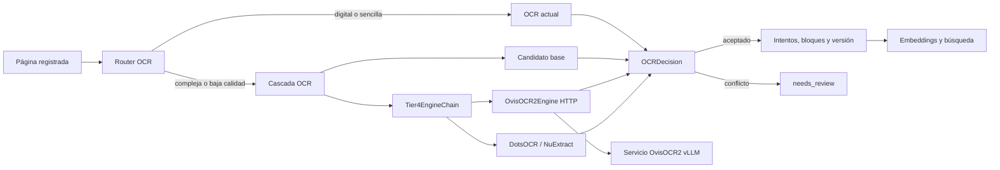

# Plan ultradetallado de implementación de OvisOCR2 en Docu-Intel

> Documento rector para la implementación en la rama `codex/integracion-ovisocr2`.
>
> Estado: listo para ejecución por fases; la implementación todavía no forma parte de este documento.
>
> Principio rector: OvisOCR2 se incorpora como un motor adicional, aislado y reversible. No sustituye indiscriminadamente al OCR existente, no altera el contrato público de `BaseOCREngine` y no se acepta una respuesta multimodal únicamente por su aparente confianza.

## 1. Objetivo

Integrar `ATH-MaaS/OvisOCR2` como motor OCR multimodal especializado en páginas difíciles —tablas, fórmulas, composiciones multicolumna, planos escaneados, manuscritos y OCR previo de baja calidad— manteniendo intactas las rutas rápidas y baratas para documentos digitales o impresos sencillos.

La integración debe cubrir el ciclo completo:

1. Inferencia aislada y reproducible.
2. Adaptación al contrato OCR interno.
3. Selección determinista de páginas elegibles.
4. Comparación contra candidatos OCR existentes.
5. Persistencia de motor, versión, bloques y decisión.
6. Métricas, trazabilidad y operación con GPU.
7. Pruebas con documentos reales y corpus dorado.
8. Despliegue canario, reversión y reprocesado controlado.

## 2. Resultado esperado

Al finalizar el plan, Docu-Intel deberá poder:

- activar o desactivar OvisOCR2 mediante configuración sin desplegar código nuevo;
- ejecutar OvisOCR2 en un servicio Docker independiente del backend y de PaddleOCR;
- conservar Markdown, tablas HTML, fórmulas LaTeX y regiones visuales devueltas por el modelo;
- convertir el resultado al contrato `OCRResult`/`OCRBlock` existente;
- invocarlo solamente para páginas elegibles o dentro de un canario estable;
- comparar su candidato con Tesseract, PaddleOCR, PP-Structure, DotsOCR y NuExtract;
- enviar a revisión los conflictos numéricos o estructurales relevantes;
- sobrevivir a timeouts, respuestas truncadas, errores CUDA y falta de VRAM;
- medir precisión, latencia, consumo de GPU, tasa de uso, aceptación y revisión;
- volver inmediatamente a la cascada actual con `OVISOCR2_ENABLED=false`;
- reprocesar de forma explícita, acotada e idempotente documentos de baja calidad.

## 3. Decisiones arquitectónicas obligatorias

### 3.1 Servicio de inferencia separado

OvisOCR2 no se instalará en `backend/requirements.txt` ni en `backend/Dockerfile.gpu`.

Se creará un servicio independiente porque la referencia oficial usa `vllm==0.22.1`, con dependencias CUDA y de inferencia que pueden entrar en conflicto con PaddleOCR, PyTorch, workers Celery y el ciclo de actualizaciones del backend. El aislamiento permite:

- cargar el modelo una sola vez;
- reiniciar la inferencia sin reiniciar el backend;
- asignar GPU, memoria y concurrencia de forma independiente;
- fijar una revisión exacta del modelo;
- construir y cachear la imagen sin invalidarla por cambios de aplicación;
- aplicar healthchecks, readiness y circuit breaker;
- revertir la integración eliminando un perfil Docker.

### 3.2 Adaptador HTTP compatible con `BaseOCREngine`

El backend incorporará `OvisOCR2Engine`, responsable de llamar al servicio interno y devolver `OCRResult`. El contrato público seguirá siendo:

```python
extract(image_path: Path) -> OCRResult
```

No se introducirán parámetros obligatorios nuevos en `BaseOCREngine`. Cualquier metadato adicional se añadirá con valores opcionales y compatibles hacia atrás.

### 3.3 OvisOCR2 es un candidato, no una verdad absoluta

El resultado se someterá a la decisión determinista existente. No se inventará una confianza fija elevada. Si el servidor no ofrece una confianza calibrada, el adaptador devolverá `confidence=None` y la calidad se derivará de:

- validez estructural;
- densidad y legibilidad del texto;
- acuerdo con candidatos independientes;
- conservación de números, fechas, importes e identificadores;
- ausencia de repetición, truncado y eco del prompt;
- reglas específicas de tablas y fórmulas.

Los conflictos numéricos significativos deberán producir revisión, no aceptación automática.

### 3.4 Integración reversible en Tier 4

La primera versión se integrará como candidato avanzado de Tier 4 mediante una cadena compatible. No se reemplazará de forma irreversible a DotsOCR o NuExtract.

Orden recomendado inicial:

1. OCR rápido o estructurado actual.
2. Evaluación de calidad y elegibilidad.
3. OvisOCR2 para el subconjunto elegible/canario.
4. DotsOCR o NuExtract si OvisOCR2 no está disponible o produce una salida inválida.
5. Comparación determinista y decisión final.

Para no romper `CascadingOCREngine`, se implementará un wrapper `Tier4EngineChain` que cumpla `BaseOCREngine` y encapsule una lista ordenada de motores. La firma actual `vlm_ocr`/`tier4_fallback` se conservará durante la migración.

### 3.5 Sin migración de base de datos en la primera entrega

La persistencia existente ya contiene motor, versión, intentos, bloques, cajas y decisión. La revisión del modelo se almacenará como versión de motor, por ejemplo:

```text
ovisocr2:<revision-fijada>
```

Solo se propondrá una migración si las pruebas demuestran que un dato operativo imprescindible no cabe en los campos actuales. No se añadirá una columna por conveniencia.

## 4. Fuentes y restricciones del modelo

- Modelo: `ATH-MaaS/OvisOCR2`.
- Licencia publicada: Apache-2.0.
- Tamaño aproximado: 0,8–0,9 B de parámetros.
- Ejecución de referencia: vLLM, además de Transformers, SGLang y Docker Model Runner.
- Salida principal: Markdown en orden de lectura natural.
- Tablas: HTML.
- Fórmulas: LaTeX.
- Regiones visuales: etiquetas con cajas normalizadas al rango `[0, 1000)`.
- Parámetros de referencia: `max_tokens=16384`, `temperature=0`, mínimo `448×448` píxeles y máximo `2880×2880` píxeles.

La implementación fijará una revisión/commit exactos del modelo; no se ejecutará contra `main` flotante. El uso de `trust_remote_code` deberá evitarse o quedar auditado, documentado y fijado a la misma revisión.

Referencias:

- <https://huggingface.co/ATH-MaaS/OvisOCR2>
- <https://github.com/AIDC-AI/Ovis>

## 5. Estado de partida del repositorio

La solución actual ya dispone de piezas que deben reutilizarse:

- `backend/app/ocr/base.py`: contratos `BaseOCREngine`, `OCRResult` y `OCRBlock`.
- `backend/app/ocr/factory.py`: creación de Tesseract, PaddleOCR, PP-Structure y cascada.
- `backend/app/ocr/cascading.py`: escalado por calidad y Tier 4.
- `backend/app/ocr/dots_mocr.py`: patrón de adaptador HTTP/VLM.
- `backend/app/services/ocr_decision.py`: validación independiente y conflictos.
- `backend/app/services/document_processing_core.py`: intentos, versiones, decisiones y bloques.
- `backend/app/services/metrics/ocr.py`: métricas OCR.
- `backend/app/core/config.py`: configuración central.
- `docker-compose.yml`: workers y asignación de GPU.

Restricciones verificadas del entorno objetivo:

- dos GPU NVIDIA GeForce RTX 4070 de 12 GB;
- GPU 0 orientada actualmente al OCR pesado;
- GPU 1 orientada actualmente a embeddings;
- workers OCR pesados con concurrencia 1;
- OvisOCR2 deberá comenzar con concurrencia 1 y un presupuesto de VRAM medido.

## 6. Arquitectura objetivo



### 6.1 Contrato HTTP interno

El servicio expondrá únicamente en la red interna Docker:

- `GET /healthz`: proceso vivo, sin garantizar modelo listo.
- `GET /readyz`: modelo cargado y capacidad de aceptar trabajo.
- `POST /v1/ocr`: inferencia de una página.

La petición usará `multipart/form-data` para evitar el coste de base64 e incluirá:

- `image`: imagen validada;
- `request_id`: identificador trazable e idempotente;
- `document_id` y `page_number`: metadatos no sensibles;
- `max_tokens` y opciones permitidas, limitadas por el servidor;
- `schema_version=1`.

Respuesta propuesta:

```json
{
  "schema_version": "1",
  "request_id": "uuid",
  "model": "ATH-MaaS/OvisOCR2",
  "revision": "sha-fijada",
  "markdown": "...",
  "blocks": [
    {
      "type": "text|table|formula|figure",
      "text": "...",
      "bbox_norm": [0, 0, 1000, 1000]
    }
  ],
  "finish_reason": "stop|length|error",
  "input_pixels": 0,
  "output_tokens": 0,
  "latency_ms": 0,
  "warnings": []
}
```

No se devolverán rutas locales del host, URLs arbitrarias ni datos del entorno.

### 6.2 Conversión al dominio OCR

El adaptador preservará el Markdown completo en `OCRResult.text` y generará bloques:

| Salida OvisOCR2 | `OCRBlock.block_type` | Caja |
|---|---|---|
| párrafo/encabezado/lista | `text` | `None` salvo evidencia |
| `<table>...</table>` | `table` | `None` salvo evidencia |
| fórmula LaTeX | `formula` | `None` salvo evidencia |
| etiqueta de región visual | `figure` | convertida de `[0,1000)` a píxeles |

No se fabricarán cajas para texto, tablas o fórmulas cuando el modelo no las entregue.

## 7. Configuración propuesta

Todas las opciones tendrán valores seguros y OvisOCR2 estará apagado por defecto:

```dotenv
OVISOCR2_ENABLED=false
OVISOCR2_ENDPOINT=http://ovisocr2:8000
OVISOCR2_MODEL=ATH-MaaS/OvisOCR2
OVISOCR2_MODEL_REVISION=<commit_sha_fijado>
OVISOCR2_TIMEOUT_SECONDS=180
OVISOCR2_CONNECT_TIMEOUT_SECONDS=5
OVISOCR2_MAX_CONCURRENCY=1
OVISOCR2_MAX_TOKENS=16384
OVISOCR2_MIN_PIXELS=200704
OVISOCR2_MAX_PIXELS=8294400
OVISOCR2_GPU_DEVICE=0
OVISOCR2_GPU_MEMORY_UTILIZATION=0.50
OVISOCR2_TIER4_PRIMARY=false
OVISOCR2_CANARY_PERCENT=0
OVISOCR2_CIRCUIT_FAILURES=3
OVISOCR2_CIRCUIT_RESET_SECONDS=120
OVISOCR2_MAX_RESPONSE_BYTES=16777216
OVISOCR2_KEEP_VISUAL_REGIONS=true
OVISOCR2_API_KEY=
```

Modos de GPU:

- **Compartido/canario inicial:** GPU 0, utilización 0,40–0,50, concurrencia 1 y prueba de carga. Es el modo de validación, no una garantía de capacidad.
- **Exclusivo recomendado:** una GPU dedicada, utilización 0,70–0,80 y concurrencia determinada por benchmark. Es el modo preferible para producción estable.

La selección definitiva de GPU no se basará en comentarios del Compose, sino en VRAM libre, pico de inferencia, convivencia real con PaddleOCR/embeddings y prueba de 200 páginas.

## 8. Archivos previstos

### 8.1 Archivos nuevos

```text
backend/app/ocr/ovisocr2.py
backend/app/ocr/ovisocr2_output.py
backend/app/ocr/tier4_chain.py
services/ovisocr2/app.py
services/ovisocr2/model.py
services/ovisocr2/schemas.py
services/ovisocr2/requirements.txt
services/ovisocr2/Dockerfile
services/ovisocr2/.dockerignore
backend/tests/test_ovisocr2_client.py
backend/tests/test_ovisocr2_output.py
backend/tests/test_ovisocr2_contract.py
backend/tests/test_ovisocr2_routing.py
backend/tests/test_ovisocr2_cascade.py
backend/tests/test_ovisocr2_integration.py
backend/tests/test_ovisocr2_golden.py
backend/tests/fixtures/ovisocr2/
scripts/benchmark_ovisocr2.py
scripts/certify_ovisocr2.ps1
docs/runbooks/ovisocr2.md
```

### 8.2 Archivos a modificar

```text
backend/app/core/config.py
backend/app/ocr/base.py
backend/app/ocr/factory.py
backend/app/ocr/cascading.py
backend/app/ocr/routing.py
backend/app/services/ocr_decision.py
backend/app/services/document_processing_core.py
backend/app/services/metrics/_registry.py
backend/app/services/metrics/ocr.py
docker-compose.yml
.env.example
scripts/terra_certify.ps1
docs/PLAN_MEJORAS_INTEGRALES_DOCU_INTEL.md
```

`backend/app/ocr/base.py` solo se modificará si se añade `engine_version: str | None = None` al final de `OCRResult`, con valor por defecto. No se cambiarán campos existentes ni constructores de forma incompatible.

## 9. Fases de implementación

## FASE 0 — Línea base, contrato y congelación de decisiones

### Objetivo

Obtener una línea base reproducible antes de añadir el nuevo motor y cerrar las decisiones que afectan a todo el diseño.

### Tareas

1. Registrar commit base, versiones CUDA/driver, VRAM en reposo y contenedores activos.
2. Ejecutar la certificación actual sin OvisOCR2.
3. Seleccionar corpus dorado real y anonimizarlo si contiene datos sensibles.
4. Medir por cada página:
   - motor elegido;
   - texto final;
   - confianza calibrada;
   - `needs_review`;
   - latencia;
   - errores y páginas vacías;
   - exactitud de números/fechas/importes;
   - calidad de tablas y orden de lectura.
5. Fijar el SHA del modelo y documentar licencia.
6. Decidir con medición si el primer canario usará GPU 0 compartida o una ventana exclusiva.
7. Congelar `schema_version=1` del servicio.

### Corpus mínimo

- las páginas actualmente marcadas con OCR bajo;
- documentos digitales nativos que jamás deberían invocar OvisOCR2;
- escaneos impresos limpios;
- tablas y presupuestos;
- capturas o exportaciones de hojas de cálculo;
- correos y documentos multicolumna;
- fórmulas;
- manuscritos;
- planos escaneados y etiquetas técnicas;
- fotografías con texto;
- páginas rotadas, borrosas y parcialmente recortadas.

Objetivo recomendado: 50–100 páginas estratificadas para la puerta inicial y al menos 200 páginas para estabilidad/VRAM.

### Entregables

- `artifacts/ovisocr2/baseline.json`;
- manifiesto del corpus con hash y categoría;
- revisión exacta del modelo;
- decisión de GPU documentada.

### Puerta de salida

- certificación base ejecutada;
- corpus representativo disponible;
- métricas base persistidas;
- ningún cambio funcional activado.

## FASE 1 — Servicio de inferencia aislado

### Objetivo

Levantar OvisOCR2 de forma reproducible sin modificar todavía la cascada OCR.

### Tareas

1. Crear `services/ovisocr2/Dockerfile` sobre una imagen CUDA compatible y fijada por digest cuando sea viable.
2. Instalar dependencias del servicio, incluida la versión oficial de vLLM, solo en esa imagen.
3. Implementar carga única del modelo al arrancar.
4. Implementar `/healthz`, `/readyz` y `/v1/ocr`.
5. Validar MIME, dimensiones, píxeles, tamaño y decodificación de imagen.
6. Aplicar `temperature=0`, límites de tokens y prompt versionado.
7. Proteger la concurrencia con semáforo de capacidad 1.
8. Devolver `503` durante carga o saturación; `422` para entrada inválida; `500` solo para fallo interno.
9. Añadir logs JSON con `request_id`, revisión, latencia, tokens, píxeles y causa de error.
10. Añadir apagado ordenado y liberación de recursos.
11. Montar una caché de modelo persistente y separada del código.

### Pruebas

- arranque sin GPU: fallo claro y no reinicio infinito;
- arranque con revisión inexistente: readiness falsa y diagnóstico explícito;
- imagen válida: respuesta conforme a esquema;
- imagen corrupta/sobredimensionada: rechazo antes de inferencia;
- dos peticiones simultáneas: una espera acotada o recibe saturación, nunca OOM silencioso;
- timeout y cancelación del cliente;
- reinicio: modelo se recupera desde caché.

### Puerta de salida

- servicio estable durante 50 peticiones;
- esquema validado;
- no expone puerto público por defecto;
- revisión del modelo visible en `/readyz` y respuestas;
- VRAM en reposo y pico documentadas.

## FASE 2 — Cliente, parser y contrato interno

### Objetivo

Convertir la salida de OvisOCR2 al dominio OCR de Docu-Intel sin conectarlo aún a producción.

### Tareas

1. Implementar `OvisOCR2Engine` con cliente HTTP reutilizable.
2. Separar timeout de conexión, lectura e inferencia.
3. Reintentar como máximo los fallos transitorios definidos; no reintentar 4xx, entrada inválida o respuesta excesiva.
4. Implementar circuit breaker por proceso.
5. Validar `schema_version`, modelo y tipos de respuesta.
6. Implementar `ovisocr2_output.py` para:
   - conservar Markdown;
   - extraer tablas HTML sin perder su estructura;
   - detectar fórmulas LaTeX;
   - extraer regiones visuales y convertir coordenadas;
   - eliminar eco del prompt;
   - detectar colas repetitivas;
   - marcar `finish_reason=length` como advertencia/truncado;
   - limitar bytes, bloques y longitud;
   - sanear HTML peligroso y URLs externas.
7. Devolver `confidence=None` salvo futura calibración demostrada.
8. Añadir versión del motor de forma compatible.

### Casos de prueba obligatorios

- Markdown simple;
- múltiples tablas;
- HTML mal cerrado;
- fórmulas inline y de bloque;
- región visual con caja válida, fuera de rango e invertida;
- respuesta vacía;
- repetición degenerativa;
- truncado por tokens;
- JSON desconocido o versión de esquema incompatible;
- timeout, conexión rechazada, 429, 503 y 500;
- imagen con nombre/ruta que contenga caracteres especiales.

### Puerta de salida

- todos los tests unitarios y contractuales verdes;
- `OvisOCR2Engine` satisface `BaseOCREngine`;
- no existen rutas de host ni secretos en logs;
- los errores degradan a un resultado controlado o excepción tipada recuperable.

## FASE 3 — Factory y cadena Tier 4 compatible

### Objetivo

Incorporar el nuevo motor a la construcción de la cascada sin cambiar el comportamiento cuando está desactivado.

### Tareas

1. Añadir configuración tipada y validaciones cruzadas en `config.py`.
2. Implementar `Tier4EngineChain` con:
   - lista ordenada de motores;
   - disponibilidad/health cacheada;
   - fallback solo ante fallo o salida inválida;
   - trazabilidad de intentos;
   - preservación del candidato base;
   - límite total de tiempo.
3. Integrar la cadena en `factory.py`.
4. Mantener DotsOCR y NuExtract según configuración existente.
5. Garantizar que `OVISOCR2_ENABLED=false` construye exactamente la topología anterior.
6. Evitar descargar/cargar el modelo desde un worker Celery.
7. Evitar una llamada de salud remota por página usando TTL corto y circuit breaker.

### Matriz de construcción

| Ovis | Dots | NuExtract | Resultado Tier 4 |
|---|---|---|---|
| off | off | off | sin Tier 4 nuevo |
| off | on | off | Dots actual |
| off | on/off | on | NuExtract y fallback actual |
| on | off | off | Ovis |
| on | on | off | Ovis → Dots |
| on | on/off | on | Ovis → NuExtract → Dots según política explícita |

### Puerta de salida

- matriz cubierta por tests;
- cero regresiones con Ovis apagado;
- timeout total de Tier 4 acotado;
- ningún fallo de Ovis cancela el procesamiento completo si existe alternativa válida.

## FASE 4 — Routing, comparación y decisión

### Objetivo

Invocar OvisOCR2 donde aporta valor y evitar coste/riesgo en páginas fáciles.

### Política inicial

OvisOCR2 será elegible cuando se cumpla alguna condición verificable:

- calidad del OCR previo inferior al umbral;
- tabla compleja o pérdida de estructura;
- fórmula o documento técnico con notación;
- composición multicolumna con orden dudoso;
- plano escaneado con etiquetas;
- manuscrito o fotografía documental;
- salida previa vacía/inconsistente;
- pertenencia estable al canario configurado.

No será elegible por defecto para:

- PDF digital con texto nativo suficiente;
- página impresa simple con calidad alta;
- archivos DXF/IFC/BC3 que requieren parsers estructurados;
- fotografías de producto cuya tarea principal sea descripción visual;
- páginas fuera de límites de seguridad.

### Tareas

1. Crear una decisión de elegibilidad pura y testeable.
2. Aplicar canario mediante hash estable de `document_id/page_number`, nunca aleatorio por ejecución.
3. Pasar la ruta/clase de contenido al motor sin cambiar la firma pública.
4. Comparar candidato base y Ovis en `ocr_decision.py`.
5. Añadir validaciones de:
   - identificadores exactos;
   - fechas e importes;
   - número de filas/columnas;
   - contenido vacío o alucinatorio;
   - similitud y cobertura;
   - orden de lectura.
6. Forzar revisión cuando Ovis y el candidato independiente discrepen en números críticos.
7. No usar la longitud de texto por sí sola para elegir ganador.

### Puerta de salida

- 0 llamadas a Ovis en el subconjunto nativo digital de control;
- elegibilidad explicable en logs/telemetría;
- conflictos críticos terminan en revisión;
- decisiones reproducibles para la misma entrada y configuración.

## FASE 5 — Persistencia, observabilidad y administración

### Objetivo

Poder explicar qué ocurrió en cada página y operar el sistema sin inspeccionar logs manualmente.

### Tareas

1. Persistir intento `ovisocr2`, revisión exacta y duración.
2. Persistir bloques con `source_engine=ovisocr2`.
3. Conservar advertencias de truncado/estructura en los metadatos ya disponibles o en el log de auditoría.
4. Añadir métricas:
   - peticiones, éxito, fallo y timeout;
   - latencia p50/p95;
   - tokens de salida y píxeles de entrada;
   - OOM y saturación;
   - circuit breaker abierto;
   - páginas elegibles e invocadas;
   - aceptado, rechazado y enviado a revisión;
   - respuesta vacía, truncada o repetitiva;
   - tablas, fórmulas y regiones extraídas;
   - fallback a Dots/NuExtract.
5. Añadir etiquetas con cardinalidad acotada: motor, resultado, ruta y versión resumida. Nunca `document_id` en Prometheus.
6. Exponer en diagnóstico/admin el motor final y la razón de decisión.
7. Añadir correlación por `request_id` en logs, no como etiqueta de métrica.

### Puerta de salida

- una página puede auditarse desde registro hasta decisión;
- métricas no crean cardinalidad no acotada;
- revisión del modelo visible en persistencia;
- panel/consulta de errores y canario documentados.

## FASE 6 — Docker, GPU, seguridad y operación

### Objetivo

Hacer la integración desplegable, cacheable y segura en el entorno real.

### Tareas Docker/GPU

1. Añadir servicio bajo perfil Compose `ovisocr2`.
2. No publicar puerto al host por defecto.
3. Montar caché de Hugging Face en volumen nombrado.
4. Separar capas de dependencias, modelo/caché y código para evitar descargas completas en cada cambio.
5. Asignar GPU mediante variable y reserva explícita.
6. Añadir límite de memoria, `shm_size`, healthcheck y política de reinicio razonable.
7. Evitar que un cambio del backend invalide la imagen OvisOCR2.
8. Documentar precarga del modelo y modo offline.
9. Ejecutar prueba de convivencia Paddle/Ovis/embeddings.

### Tareas de seguridad

1. Red interna y token bearer opcional rotatable.
2. Usuario no root cuando vLLM/CUDA lo permita.
3. Límites de tamaño, píxeles, tiempo y respuesta.
4. Protección de Pillow frente a bombas de descompresión.
5. Validación por contenido, no solo extensión.
6. Prohibición de URLs externas y rutas arbitrarias.
7. Sanitización de Markdown/HTML antes de mostrarlo en UI.
8. Sin nombres originales sensibles en prompts si no son necesarios.
9. Escaneo de imagen, SBOM y aviso de licencia.
10. Revisión de código remoto y pin de modelo/dependencias.

### Puerta de salida

- recompilar backend no descarga el modelo;
- reiniciar Ovis usa la caché persistente;
- servicio inaccesible desde fuera de la red autorizada;
- prueba de 200 páginas sin OOM, bloqueo permanente ni degradación del worker;
- procedimiento de recuperación tras OOM documentado.

## FASE 7 — Pruebas y certificación comparativa

### Pirámide de pruebas

1. **Unitarias:** parser, cajas, sanitización, routing, circuit breaker y configuración.
2. **Contrato:** cliente/servidor con esquema versionado.
3. **Integración:** servicio real con una muestra pequeña y GPU.
4. **Cascada:** fallos, fallback, decisión y persistencia.
5. **Corpus dorado:** comparación página a página.
6. **Rendimiento:** latencia, VRAM, concurrencia y soak test.
7. **Regresión:** chat, búsqueda, fuentes y bloques resultantes.

### Métricas de calidad

- CER/WER para texto donde exista transcripción;
- exactitud exacta de identificadores, fechas, importes y cantidades;
- calidad estructural/TEDS o equivalente para tablas;
- orden de lectura;
- cobertura de contenido;
- tasa de páginas vacías/truncadas;
- tasa de autoaceptación y `needs_review`;
- precisión de recuperación en preguntas reales del chat;
- latencia p50/p95 y pico de VRAM.

### Puertas de aceptación

Los umbrales definitivos se fijarán a partir de FASE 0. Como mínimos:

- ninguna regresión estadísticamente relevante en números críticos;
- mejora de estructura de tablas en el subconjunto elegible;
- reducción relativa de revisión en páginas elegibles sin elevar falsos positivos;
- cero llamadas a Ovis para documentos nativos no elegibles;
- cero OOM/crashes en el soak test de 200 páginas;
- fallback completo cuando el servicio está detenido;
- ausencia de respuestas truncadas aceptadas como finales sin advertencia;
- pruebas actuales del backend siguen verdes con Ovis apagado.

El p95 objetivo inicial se registrará, pero no se aprobará un límite artificial antes de medir la RTX 4070 real. La calidad prevalece sobre una cifra de latencia inventada; posteriormente se fijará un SLO operativo explícito.

### Comandos de certificación previstos

```powershell
docker compose --profile ovisocr2 build ovisocr2
docker compose --profile ovisocr2 up -d ovisocr2
docker compose exec backend pytest -q tests/test_ovisocr2_client.py tests/test_ovisocr2_output.py
docker compose exec backend pytest -q tests/test_ovisocr2_contract.py tests/test_ovisocr2_cascade.py
python scripts/benchmark_ovisocr2.py --manifest artifacts/ovisocr2/corpus.json --output artifacts/ovisocr2/candidate.json
powershell -ExecutionPolicy Bypass -File scripts/certify_ovisocr2.ps1
```

## FASE 8 — Despliegue canario y promoción

### Objetivo

Activar OvisOCR2 gradualmente y con reversión inmediata.

### Secuencia

1. Desplegar servicio con `OVISOCR2_ENABLED=false`.
2. Verificar health/readiness, caché, GPU y métricas.
3. Activar en un entorno de prueba con corpus dorado.
4. Activar `CANARY_PERCENT=5` solo para rutas elegibles.
5. Observar al menos un ciclo operativo completo.
6. Promover a 25 % si cumple calidad, latencia, VRAM y revisión.
7. Promover a 100 % de páginas elegibles; nunca a 100 % de todas las páginas.
8. Mantener Dots/NuExtract durante todo el canario.

### Condiciones de parada automática/manual

- cualquier OOM repetido;
- circuit breaker abierto de forma sostenida;
- aumento de errores o revisión respecto a línea base;
- discrepancias numéricas superiores al umbral;
- respuestas vacías/repetitivas por encima del umbral;
- degradación de workers OCR o embeddings;
- latencia que incumpla el SLO acordado.

### Rollback

1. Establecer `OVISOCR2_ENABLED=false` o `CANARY_PERCENT=0`.
2. Reiniciar solamente procesos que lean configuración al arranque.
3. Mantener intentos históricos; no borrar resultados ni auditoría.
4. Confirmar retorno a Dots/NuExtract/cascada previa.
5. Reprocesar páginas afectadas únicamente mediante job explícito.

## FASE 9 — Reprocesado controlado y mejora del corpus existente

### Objetivo

Aplicar OvisOCR2 a documentos existentes con baja calidad sin lanzar un reprocesado masivo no controlado.

### Tareas

1. Crear selección auditable por:
   - baja confianza;
   - `needs_review`;
   - OCR vacío;
   - tabla/estructura perdida;
   - documento o página explícitos.
2. Implementar modo `dry-run` con conteo y motivos.
3. Crear jobs por lotes pequeños, idempotentes y reanudables.
4. Limitar páginas por ejecución, concurrencia y ventana horaria.
5. Conservar candidato anterior y crear un nuevo intento.
6. Comparar antes de sustituir resultado final.
7. Emitir informe antes/después.
8. Comenzar por las páginas de OCR bajo ya identificadas; ampliar solo tras revisión.

### Puerta de salida

- no existe reprocesado global implícito;
- cada cambio conserva trazabilidad;
- el job puede detenerse y reanudarse;
- informe de mejora y regresiones disponible.

## FASE 10 — Documentación, runbook y cierre

### Entregables

- runbook de despliegue, precarga, diagnóstico y rollback;
- matriz de configuración por desarrollo/canario/producción;
- resultados del benchmark y certificación;
- decisiones de GPU y SLO;
- licencia, revisión y hashes del modelo;
- guía para actualizar el modelo sin saltarse el corpus dorado;
- actualización del plan integral del producto;
- incidencias conocidas y límites de uso.

### Definition of Done global

La integración solo estará completa cuando:

1. OvisOCR2 se ejecute en servicio aislado y con modelo fijado.
2. El backend cumpla el contrato existente con Ovis activado y desactivado.
3. La cascada conserve DotsOCR/NuExtract como alternativas.
4. El routing evite páginas nativas/fáciles.
5. Los conflictos críticos produzcan revisión.
6. Intentos, bloques, versión y decisión sean auditables.
7. Existan métricas, healthchecks y circuit breaker.
8. Docker reutilice dependencias y caché del modelo.
9. El corpus dorado y el soak test cumplan las puertas acordadas.
10. El canario alcance las páginas elegibles sin incidentes bloqueantes.
11. El rollback se haya ensayado, no solo documentado.
12. Chat y búsqueda recuperen correctamente el contenido mejorado.
13. Todas las pruebas previas sigan verdes con la funcionalidad apagada.

## 10. Riesgos y mitigaciones

| Riesgo | Impacto | Mitigación | Señal de control |
|---|---|---|---|
| conflicto CUDA/vLLM/Paddle | alto | servicio e imagen separados | build y arranque independientes |
| OOM en RTX 4070 | alto | concurrencia 1, presupuesto VRAM, canario | VRAM pico, OOM, readiness |
| alucinación o números alterados | alto | comparación independiente y revisión | exactitud numérica/conflictos |
| salida truncada por tokens | alto | `finish_reason`, límites y no autoaceptar | tasa de truncado |
| tablas HTML peligrosas | alto | sanitización y render seguro | tests XSS/HTML |
| descarga repetida del modelo | medio | volumen de caché y Docker por capas | tiempo/reuso de arranque |
| latencia excesiva | medio | routing selectivo, SLO y cola | p50/p95 y backlog |
| regresión de Dots/NuExtract | alto | cadena compatible y feature flag | matriz de factory |
| revisión flotante del modelo | alto | SHA fijado y hashes | versión persistida |
| reprocesado descontrolado | alto | dry-run, lotes, idempotencia | jobs y auditoría |
| observabilidad con alta cardinalidad | medio | etiquetas acotadas | series Prometheus |
| exposición de documentos | alto | red interna, límites y logs mínimos | auditoría de red/logs |

## 11. Exclusiones explícitas

Esta implementación no debe:

- reemplazar parsers nativos de PDF, Office, DXF, IFC o BC3;
- convertir OvisOCR2 en motor universal para todas las páginas;
- confiar en una autoconfianza fabricada por el modelo;
- añadir vLLM al backend principal;
- cargar el modelo por cada tarea Celery;
- reprocesar todo el corpus en el primer despliegue;
- borrar candidatos o intentos anteriores;
- exponer el servicio a Internet;
- aceptar HTML sin sanitizar;
- cambiar la firma obligatoria de `BaseOCREngine`;
- ocultar fallos mediante un fallback silencioso sin métricas.

## 12. Estrategia Git para la implementación

Rama de trabajo objetivo:

```text
codex/integracion-ovisocr2
```

La rama debe nacer del commit consolidado y publicado de `fix/remediacion-auditoria-2026-07`.

Secuencia de commits recomendada:

1. `test(ocr): fijar baseline y contratos OvisOCR2`
2. `feat(ocr): añadir servicio aislado OvisOCR2`
3. `feat(ocr): añadir adaptador y parser OvisOCR2`
4. `feat(ocr): integrar cadena Tier 4 configurable`
5. `feat(ocr): añadir routing y decisión OvisOCR2`
6. `feat(ocr): persistir y observar intentos OvisOCR2`
7. `build(ocr): integrar perfil Docker y GPU OvisOCR2`
8. `test(ocr): certificar corpus y rendimiento OvisOCR2`
9. `docs(ocr): documentar operación y rollback OvisOCR2`

Cada fase debe dejar pruebas verdes y una reversión comprensible. No se mezclará el cambio de inferencia con refactors generales no necesarios.

## 13. Orden de ejecución operativo

```text
FASE 0  baseline y decisiones
   ↓
FASE 1  servicio aislado
   ↓
FASE 2  adaptador y parser
   ↓
FASE 3  factory y Tier 4
   ↓
FASE 4  routing y decisión
   ↓
FASE 5  persistencia y métricas
   ↓
FASE 6  Docker, GPU y seguridad
   ↓
FASE 7  certificación completa
   ↓
FASE 8  canario y promoción
   ↓
FASE 9  reprocesado acotado
   ↓
FASE 10 documentación y cierre
```

No se avanzará de fase si su puerta de salida falla. Un fallo de calidad, seguridad, persistencia o reversibilidad bloquea la promoción aunque la inferencia funcione visualmente.

## 14. Estimación y complejidad

Complejidad global: alta, principalmente por integración GPU, validación de salidas generativas, coexistencia con varios motores y necesidad de certificar con documentos reales.

Estimación orientativa para un implementador asistido por IA y con acceso al entorno:

| Bloque | Esfuerzo orientativo |
|---|---:|
| baseline y corpus | 0,5–1,5 días |
| servicio OvisOCR2 | 1–2 días |
| adaptador/parser | 1–2 días |
| cascada/routing/decisión | 1,5–3 días |
| persistencia/métricas/Docker | 1–2 días |
| pruebas, benchmark y canario | 2–4 días |
| documentación y cierre | 0,5–1 día |

Total orientativo: 7,5–15,5 días efectivos. La descarga inicial, disponibilidad de GPU, etiquetado del corpus y corrección de conflictos numéricos pueden ampliar el calendario. No se reducirá la certificación para cumplir una fecha artificial.

## 15. Primer paso al abrir la rama nueva

La primera ejecución en `codex/integracion-ovisocr2` debe limitarse a FASE 0:

1. verificar que la rama nace del commit consolidado;
2. comprobar que el árbol está limpio;
3. ejecutar certificación base;
4. registrar GPU/driver/VRAM;
5. crear el manifiesto del corpus;
6. fijar revisión y hashes del modelo;
7. guardar el baseline;
8. detenerse si la certificación actual no está verde y diagnosticar antes de escribir la integración.
